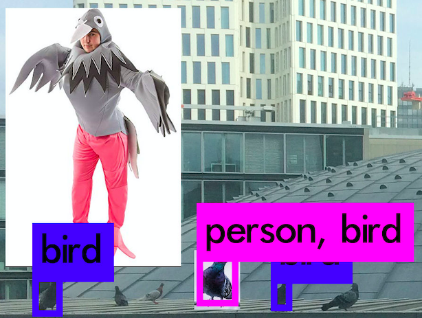

# Pigeon Counter

Uses a RaspberryPi with an imaging sensor to automatically take pictures of pigeons. With the wonders of machine learning the pigeons in the picture should then be counted and the results stored in a simple database to retrieve later.

Some questionable results from the default Yolo/Darknet detection:




Some basic things can be configured in the `config.json`:
```json
{
  "image_path": "images",
  "log_path": "log",
  "metadata_path": "metadata",
  "sensor_location_city": "Berlin",
  "sensor_location_lat": 53,
  "sensor_location_lng": 13,
  "acquisition_delay": 180,
  "OWM_API_KEY": ""
}
```
`acquisition_delay` is the amount of seconds in between each image.